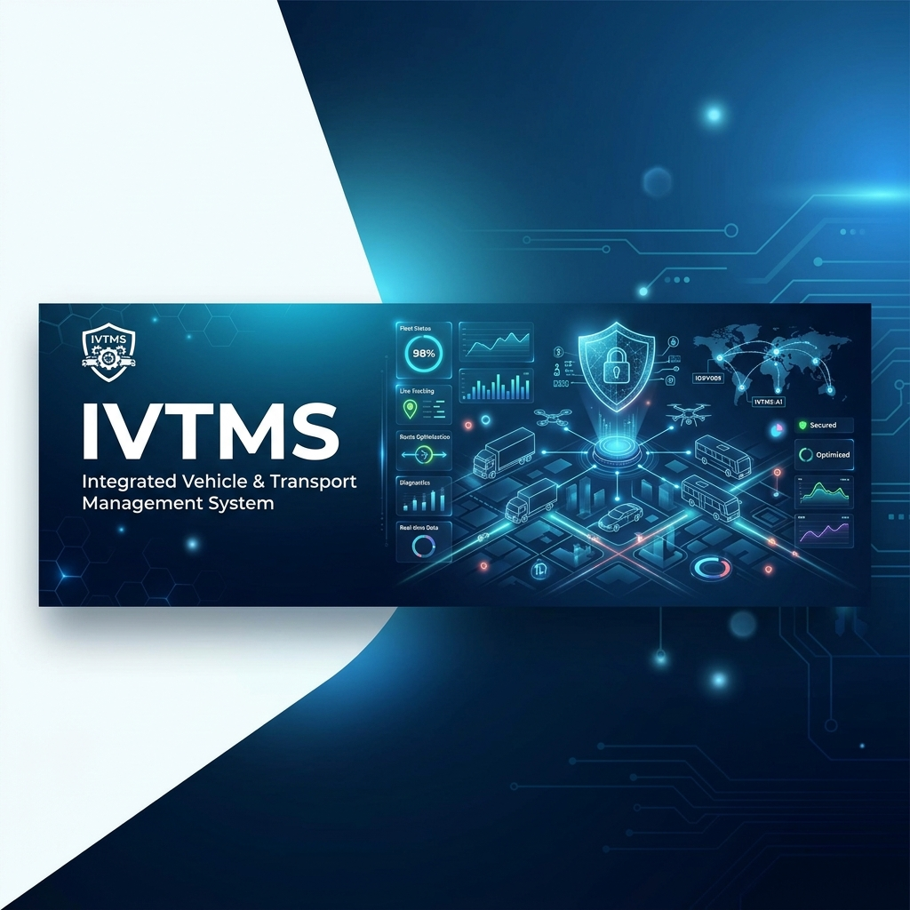

# IVTMS - Integrated Vehicle & Transport Management System



[](https://github.com/Sarvesh-Gore-1409/Ivtms)
[](LICENSE)
[](https://spring.io/projects/spring-boot)
[](https://www.mysql.com/)

**IVTMS** is a unified digital ecosystem designed to streamline vehicle compliance, registration, and transport management. It provides a secure, role-based platform for citizens, RTO officers, PUC inspectors, and system administrators.

---

## ✨ Key Features

- 👤 **Citizen Dashboard**: Manage vehicle RC, track insurance, and monitor PUC status.
- 👮 **RTO Management**: Process vehicle registrations, permits, and tax records.
- 🧪 **PUC Compliance**: Specialized interface for inspectors to verify vehicle emissions.
- 🛡️ **Advanced Security**: BCrypt password hashing and role-based access control (RBAC).
- 🧠 **ML Integration**: AI-driven fraud detection for chassis and registration anomalies.
- 📊 **Real-time Analytics**: Interactive dashboards with AOS animations and theme switching.

---

## 📁 Repository Structure

```text
IVTMS/
 ├── backend/       # Spring Boot 3 REST API & Thymeleaf Templates
 ├── frontend/      # Standalone HTML/JS/CSS Frontend Assets
 ├── ml-service/    # Python Flask/FastAPI Service for AI-driven Fraud Detection
 ├── docs/          # Project documentation, database scripts, and assets
 ├── .gitignore     # Git exclusion rules
 ├── LICENSE        # Project licensing information
 └── README.md      # Project overview and setup guide
```

---

## 🛠️ Technology Stack

| Layer | Technologies |
| :--- | :--- |
| **Frontend** | HTML5, Bootstrap 5, JavaScript, AOS, Bootstrap Icons |
| **Backend** | Java 17, Spring Boot 3, Spring Security 6, JPA/Hibernate |
| **Database** | MySQL 8.0 |
| **Machine Learning** | Python 3.9+, Flask/FastAPI, TensorFlow/Scikit-learn |

---

## 🚀 Getting Started

### 1. Prerequisites
- **Java 17+** & **Maven 3.9+**
- **MySQL 8.0+**
- **Python 3.9+** (for ML service)

### 2. Database Initialization
Create a database named `ivtms_db` and import the schema:
```bash
mysql -u root -p < docs/database/ivtms_schema.sql
```

### 3. Environment Configuration
Configure the following environment variables on your system:
- `DB_USERNAME`: Your MySQL username
- `DB_PASSWORD`: Your MySQL password
- `ADMIN_PASSWORD`: Default admin password
- `RTO_PASSWORD`: Default RTO password

### 4. Running the Application
**Backend:**
```bash
cd backend
mvn spring-boot:run
```
The application will be available at `http://localhost:8081`.

**ML Service:**
```bash
cd ml-service
# Follow instructions in ml-service/README.md
```

---

## 🔒 Security Policy
All sensitive data including database credentials and user passwords are encrypted. Passwords use **BCrypt** hashing. For production deployment, ensure `ddl-auto` is set to `validate` in `application.yml`.

---

## 📄 License
This project is licensed under the **Apache License 2.0**. See the [LICENSE](LICENSE) file for details.

---

<p align="center">Made with ❤️ for a safer and more efficient transport system.</p>
